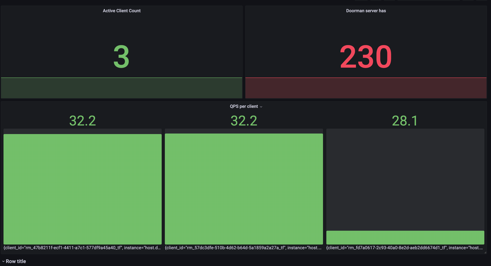

# Doorman Simulations

The Simulation test is a simple test that sends a large number of requests to the server from different client instances trying to concurrently access the same resource, but configured with a different rate limit. 
The goal of this test is to ensure the rate limit and dynamic rate limit changes are working as expected based of additions/removals of clients.

## Setup
This is more of an end-to-end test, so you will need to have a few things setup before you can run the test and measure the results.

### I. Setting up doorman. 
   1. Clone this fork [doorman](https://github.com/Pythonista7/doorman) repository. I've tried to keep the changes minimal and only added changes with the intentions of being able to run the project by satisfying the modern go requirements to build & run.
   2. `cd go/cmd/doorman` and run `go build` to build the binary after which you should see a `doorman` binary in the same directory.
   3. Run the binary with the following command , 
   ```shell
   ./doorman -logtostderr -config=path-to-config.yml -port=15000 -debug_port=15050 -etcd_endpoints=http://localhost:2379 -master_election_lock=/doorman.master -master_delay=300s -hostname=localhost
   ```
     > *Note*: 
     > * You will need to have etcd running on your machine `brew install etcd` and run `etcd` on a new sh to start the etcd server.
     > * Also, you will need to have a config file, you can use the one in the `doc/simplecluster/config.yaml` directory or create your own.
   4. You should see the doorman server running on `localhost:15000` and the debug server running on `localhost:15050`.
   5. For the purposes of the test add the following to the `config.yaml` file which defines the resources which we will be testing against. (you will need to restart the doorman server for the changes to take effect)
   ```yaml
       - identifier_glob: tf
         capacity: 100
         safe_capacity: 10
         description: fair share example
         algorithm:
         kind: FAIR_SHARE
         lease_length: 60
         refresh_interval: 30
   ```
   6. You can try a basic sanity check by building and running the cli client in the `go/cmd/doorman_shell` directory. 
```shell
 go build
./doorman_shell --server=localhost:15000
> get cli1 tf 100
> get cli2 tf 100
> get cli3 tf 30
> show
client: "cli1"
resource: "tf"
capacity: 0

client: "cli2"
resource: "tf"
capacity: 0

client: "cli3"
resource: "tf"
capacity: 0

# After the  "refresh_interval" which should be 30 seconds as per the above config , if you try `show` again you should see this which indicates we are all good.
> show
client: "cli1"
resource: "tf"
capacity: 35

client: "cli2"
resource: "tf"
capacity: 35

client: "cli3"
resource: "tf"
capacity: 30

# Release the resources
> release cli1 tf
> release cli2 tf
> release cli3 tf
> show
> 
# (should not return anything indicating resources are released from the cli-client, but the resources are still being held by the server until the lease expires i.e: 60sec in this config.)
```

### II. Set up a target server to test against.
Clone [this sitting-duck server](https://github.com/Pythonista7/Ktor-Sitting-Duck) and follow the simple instructions in the readme to get the server and some grafana running on http://localhost:3000


### III. Running this project
   1. Clone this repository and gradle sync and build.
   2. Run the test `simulationOne()` from the `src/test/kotlin/client/Simulation.kt` file.

### IV. Observing the results
1. You can observe the results in the grafana dashboard that you should have running on `http://localhost:3000` with the default credentials.
2. You can also try to create additional clients from the `doorman_shell` cli client , try to access the same `tf` resource and observe the changes in the dashboard as the clients are added/removed and how that affects the actual through put of the other clients showcasing dynamic the rate limiting.

# Results


*Note* : I sometimes find that only one client is actively sending requests or only the other 2 clients are sending requests, I'm not sure why this is happening but I suspect it has to do with the way the simulation test coroutines are being launched/scheduled. I will need to investigate this further. 
But the individual tests for the rate limiter [RateLimiterTest.kt](RateLimiterTest.kt) seem to be working as expected and should ideally be the same for the simulation test as well.